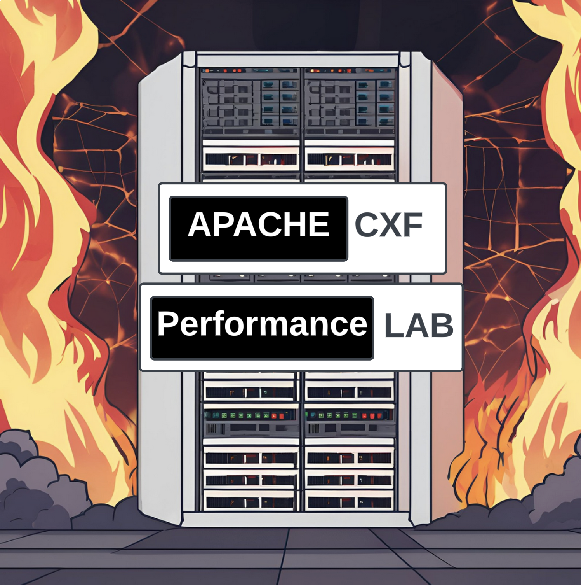

== Apache CXF JAX-RS Performance Follow Up

In our last https://github.com/savoirtech/apache-cxf-jax-rs-performance[post], we recounted our journey to processing ~1.5 Billion JAX-RS calls in an eight-hour period. This lead to several readers reaching out with suggestions for tweaks to the scenarios run, or entirely new configurations. In this post we seek to provide some answers.

=== Brief Recap

After several iterations we found that we could reach peak throughput using the following Client and Server side settings:

[cols("1","1")]
|===
^| Parameter ^| Setting

| MAVEN_OPTS
| -Xms32m -Xmx8192m

| file handle ulimit
| /etc/security/limits.conf hard & soft limits increased to 655350

| ip_local_port_range
| sysctl -w net.ipv4.ip_local_port_range="15000 64000" to allow 49K connections.

|===

PPC64LE Server:
[,bash,linenum]
----
$mvn -Pserver -Dhost=0.0.0.0 -Dprotocol=http
----
x86 Client:
[,bash,linenum]
----
$mvn -Pclient -Dhost=192.168.50.154 -Dprotocol=http -Doperation=get -Dthreads=48 -Dtime=28800
----

This resulted in:
[,bash,linenum]
----
=============Overall Test Result============
Overall Throughput: get 1092.5105255070816 (invocations/sec)
Overall AVG. response time: 0.9153229892552811 (ms)
1.510322517E9 (invocations), running 1382432.921 (sec)
============================================
----

That's 1,510,322,517 calls in eight hours.

== Can you try Java 21 again with Java 17's Heap & Tuning?

Sure!

48 clients resulted in:
[,bash,linenum]
----
jakarta.ws.rs.ProcessingException: java.net.ConnectException: ConnectException invoking http://192.168.50.154:9000/customerservice/customers/123: Cannot assign requested address
----

Reducing clients to 32, we observe:
[,bash,linenum]
----
jakarta.ws.rs.ProcessingException: java.net.ConnectException: ConnectException invoking http://192.168.50.154:9000/customerservice/customers/123: Cannot assign requested address
----

Yikes...

Let's try 16 clients?
[,bash,linenum]
----
=============Overall Test Result============
Overall Throughput: get 1729.583164802507 (invocations/sec)
Overall AVG. response time: 0.5781739903291584 (ms)
7.9699786E8 (invocations), running 460803.43299999996 (sec)
============================================
----

Just 79,699,786 calls in eight-hours.

=== How does that compare to our last Java 21 test?

In our prior lab test we achieved 1,510,322,517 calls in eight-hours, this run provided 79,699,786 - a delta improvement of negative 1,430,622,731 invocations :S

Something has to be seriously wrong.

=== Sanity check time - lets retest client configuration:

==== 16 x64 clients calling the PPC64LE server for five minutes:

[cols("1","1","1","1")]
|===
^| JVM Version ^| Parameters ^| Calls ^| Average Calls/Second

| Temurin 21
| Baseline
| 8715658
| 4803.329

| Temurin 17
| Baseline
| 8657166
| 4803.134

| Bellsoft 17
| Baseline
| 8307361
| 4803.413

| Semeru 17
| Baseline
| 7973415
| 4804.615

|===

Note: PPC64LE Server runs Temurin 21 for all runs.

==== 48 x64 clients calling the PPC64LE server for five minutes:

[cols("1","1","1","1")]
|===
^| JVM Version ^| Parameters ^| Calls ^| Average Calls/Second

| Temurin 21
| Baseline
| BindException
| BindException

| Zulu 21
| Baseline
| BindException
| BindException

| Semeru 21
| Baseline
| BindException
| BindException

| Temurin 17
| Baseline
| 16665916
| 14435.21

| Bellsoft 17
| Baseline
| 1632493
| 14435.513

| Semeru 17
| Baseline
| 13683021
| 14440.8

|===

Note: PPC64LE Server runs Temurin 21 for all runs.

===== Analysis

At lower client counts, Java 17 and 21 appear to work much the same.

On Java 21, when we use 48 clients we quickly hit bind exceptions.

On Java 17, we do not experience bind exceptions using 48 clients.

OpenJDK and OpenJ9 implementations exhibit the same behavoir.

=== Lets tune the networking stack to see if we can support more clients.

[cols("1","1","1","1")]
|===
^| Sysctl Parameter ^| Default Value ^| Tested Value ^| Result

| net.ipv4.tcp_congestion_control
^| reno
^| cubic
| No change to runtime behavoir in test case.

| net.ipv4.tcp_fin_timeout
^| 60
^| 10
| No change to runtime behavoir in test case.

| net.ipv4.tcp_max_tw_buckets
^| 262144
^| 450000
| No change to runtime behavoir in test case.

| net.ipv4.tcp_tw_reuse
^| 2
^| 1
| 48 Clients managed to complete test case in stable manner.

|===

Notes: tcp_tw_reuse allows sockets in the "time-wait" state to be reused for new connections. By default, this is usually set to 0 (off), on our x64 Ubuntu 22.04 LTS system its set to value 2 meaning enable for loopback traffic only.

When we tested with net.ipv4.tcp_tw_reuse set to 1, the clients did not reach port range saturation.

[,bash,linenum]
----
=============Overall Test Result============
Overall Throughput: get 919.9335415653302 (invocations/sec)
Overall AVG. response time: 1.0870350463561 (ms)
1.328412E7 (invocations), running 14440.303999999996 (sec)
============================================
----

=== Lets retest Java 21 with our network tuning!

Retaining net.ipv4.tcp_tw_reuse set to 1, lets run our 48 clients for eight-hours.

A quick peek at our socket statistic:
[,bash,linenum]
----
jgoodyear@jgoodyear-PowerEdge-R250:~$ ss -s
Total: 758
TCP:   24475 (estab 45, closed 24416, orphaned 0, timewait 24415)
----

Results in:

[,bash,linenum]
----
=============Overall Test Result============
Overall Throughput: get 930.9631949741151 (invocations/sec)
Overall AVG. response time: 1.0741563204631353 (ms)
1.287000102E9 (invocations), running 1382439.294 (sec)
============================================
----

1,287,000,102 calls in eight-hours.

This is lower than our original Java 17 run - so lets run this again using Java 17 client (Java 21 server side) and our new network stack setting.

Running the Java 17 Client, we observe:

[,bash,linenum]
----
=============Overall Test Result============
Overall Throughput: get 1076.1037411424204 (invocations/sec)
Overall AVG. response time: 0.9292784345665162 (ms)
1.487645195E9 (invocations), running 1382436.5979999998 (sec)
============================================
----

1,487,645,195 is slightly less than the 1,510,322,517 calls our first testing run made (Java 17 Client and Server).

==== Java 17 retest with tuning:

Given our tuning changes, we retest Java 17 on Client and Server side.

[,bash,linenum]
----
=============Overall Test Result============
Overall Throughput: get 1090.3039774065207 (invocations/sec)
Overall AVG. response time: 0.9171754122906856 (ms)
1.507275864E9 (invocations), running 1382436.3619999993 (sec)
============================================
----

This test run resulted in 1,507,275,864 calls in eight-hours.

== Conclusions

A direct update to Java 21 in our testing scenario results in lower throughput and stability issues. With careful tuning, we can get runtime throughput closer to that of our out-of-the-box Java 17.

If you update your deployment to Java 21, please review your logs for instances of `ProcessingException: java.net.ConnectException`, and if found check your socket statistic (`ss -s`) for ephemeral port contention. The key behavior to check is `TIME-WAIT`, allowing for immediate reuse can greatly improve throughput BUT must be carefully vetted with your administrators before implementing.

== About the Authors

link:https://github.com/savoirtech/blogs/blob/main/authors/JamieGoodyear.md[Jamie Goodyear]

== Reaching Out

Please do not hesitate to reach out with questions and comments, here on the Blog, or through the Savoir Technologies website at https://www.savoirtech.com.

== With Thanks

Thank you to the Apache CXF community.

(c) 2024 Savoir Technologies
